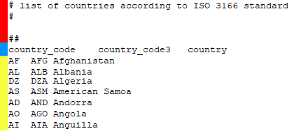
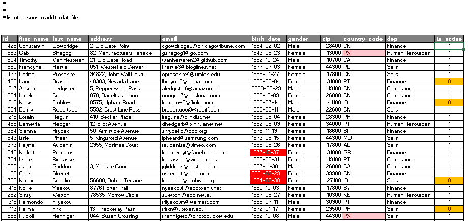

## Dataset

Cada *dataset* é composto por um ficheiro csv. Existem vários ficheiros na pasta ***datasets***.

### Estrutura dos ficheiros

Em cada ficheiro de dados do *dataset* apresenta as seguintes características:

- Cada linha contém um registo de dados terminando a linha com o caráter *newline* (\n);
- Os campos de dados são separados entre si pelo caráter *tab* (\t);
- Poderá existir um número variável de linhas de comentário antes ou no meio dos dados.
- Uma linha do dataset é considerada um comentário se:
  - Começar pelo caráter **#**;
  - Não contiver qualquer caráter (linha vazia);
  - For composta apenas por espaço(s) e/ou *tab*(s) (\t).
- Existe apenas uma linha com o cabeçalho das colunas antes da primeira linha de dados. No caso da lista de pessoas, a linha de cabeçalho começa pela *string* **id[espaço]**.

### Exemplo de ficheiro de dados

<figure align="center">
    
    <figcaption>Comentários (vermelho) | Cabeçalho (azul) | Dados (amarelo)</figcaption>
</figure>

### Ficheiros com dados de pessoas  (all-persons.csv, sample.csv e some.csv)

Os ficheiros com dados de pessoas apresentam os seguintes campos:

- **id** - Identificador da pessoa (Inteiro);
- **first_name** - Primeiro nome (*String*);
- **last_name** - Apelido (*String*);
- **address** - Morada (*String*);
- **email** - Email (*String*);
- **birth_date** - Data de nascimento (*Date*);
- **gender** - Género (*String*);
- **zip** - Código Postal (Inteiro);
- **country_code** - Código de país (*String*);
- **dep** - Departamento (*String*);
- **is_active** - Status do registo (**true** - registo ativo | **false** - registo apagado) (*Boolean*). 

<figure align="center">
    
    <figureCaption>Ficheiro: <b>all-persons.csv</b></figureCaption>
</figure>

> :warning: **Atenção** - O conteúdo de alguns campos do ficheiro podem não ser válidos ou apresentar características especiais. 
>
> No exemplo em cima:
>
> - **birth_date** - Algumas datas podem ser inválidas (vermelho);
> - **address** - Moradas podem não ter conteúdo (*string* vazia);
> - **is_active** - Quando for falso, o registo existe, deve ser lido pela aplicação, mas deve ser ignorado por esta (laranja).
> 

### Ficheiro countries.csv

O ficheiro **country.csv** apresenta os seguintes campos:

- **country_code** - Código único de país com 2 *chars* (String);
- **country_code3** - Código único de país com 3 *chars* (String);
- **country** - País (String).

